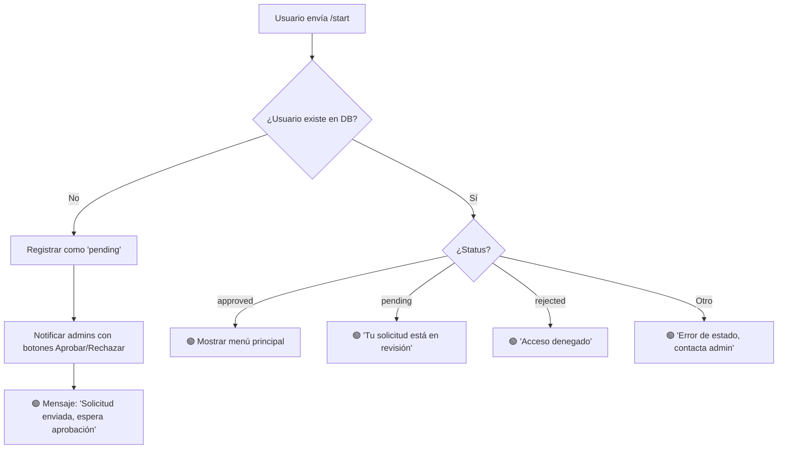
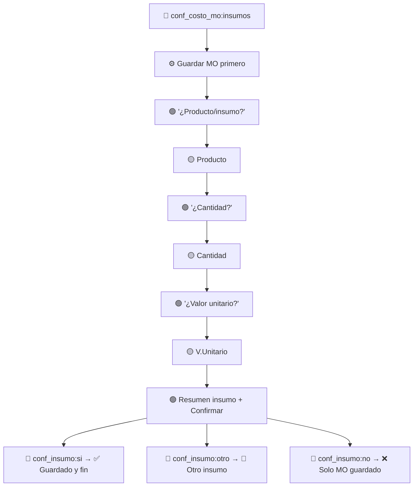

# 🔄 Diagramas de Flujo — Bot Asistente Caficultor ☕

> **Documentación de flujos de conversación, estados FSM y secuencia de mensajes**
> Actualizado: Junio 2026

---

## 📋 Convenciones

| Símbolo | Significado |
|---------|-------------|
| 🟢 **Mensaje del bot** | Texto que envía el bot al usuario |
| 🟡 **Entrada del usuario** | Texto o callback que envía el usuario |
| 🔵 **Callback (botón)** | Botón inline que el usuario presiona |
| ⚙️ **Lógica interna** | Procesamiento que hace el bot sin interacción |
| 🔀 **Decisión** | Ramificación condicional del flujo |

---

## 1. 🏠 `/start` — Registro y verificación de acceso

### FSM States: *Ninguno (no usa FSM)*



### Secuencia de mensajes

```
Usuario: /start
──────────────────────────────────────
🟢 Bot: "☕ ¡Bienvenido al Asistente Caficultor! 🌱
         Hola [nombre], gracias por tu interés.
         Tu solicitud de acceso ha sido enviada...
         [botón: 🏠 Menú Principal]"
──────────────────────────────────────
🟡 Admin: Recibe notificación con botones:
         [✅ Aprobar] [❌ Rechazar]
```

---

## 2. 🏠 `/menu` — Menú principal

### FSM States: *Ninguno (limpia cualquier estado activo)*

```mermaid
graph TD
    A[/menu, /cancelar o /] --> B[⚙️ state.clear()]
    B --> C{¿Usuario aprobado o admin?}
    C -->|No| D[🟢 'Esperando aprobación']
    C -->|Sí| E[🟢 Mostrar menú con botones:]
    E --> F[🏠 Fincas | 🌱 Lotes]
    E --> G[💰 Ingresos | 📉 Costos]
    E --> H[📊 Resumen | 📋 Exportar Excel]
    E --> I[📥 Importar Excel | 🗑️ Borrar datos]
    E --> J[❓ Ayuda | 🔧 Admin solo si es admin]
```

### Callbacks del menú

| Callback | Ruta | Handler |
|----------|------|---------|
| `menu_fincas` | `/fincas` | `fincas.py` |
| `menu_lotes` | `/lotes` | `lotes.py` |
| `menu_ingresos` | `/ingreso` | `ingresos.py` |
| `menu_costos` | `/costo` | `costos.py` |
| `menu_resumen` | `/resumen` | `reportes.py` |
| `menu_excel` | -> Exportar | `reportes.py` |
| `menu_importar` | -> Importar | `importar.py` |
| `menu_ayuda` | `/ayuda` | `ayuda.py` |
| `ir_borrar` | -> Borrar datos | `menu.py` |
| `ir_admin` | -> Admin panel | `menu.py` |
| `volver_menu` | Vuelve al menú | `menu.py` |
| `cancelar_operacion` | Cancela flujo | `menu.py` + `costos.py` |

---

## 3. 🗺️ `/fincas` — Gestión de fincas

### FSM States: `FincaForm`

| Estado | Descripción |
|--------|-------------|
| `FincaForm.esperando_nombre` | Esperando nombre de la finca |
| `FincaForm.esperando_region` | Esperando región |
| `FincaForm.esperando_departamento` | Esperando departamento |

```mermaid
graph TD
    A[/fincas o menu_fincas] --> B[⚙️ state.clear()]
    B --> C[🟢 Lista fincas + botón ➕ Nueva Finca]
    C --> D[🔵 nueva_finca]
    D --> E[🟢 'Paso 1/3: ¿Nombre de la finca?']
    E --> F[🟡 Usuario escribe nombre]
    F --> G{¿Ya existe finca con ese nombre?}
    G -->|Sí| H[🟢 'Ya tienes una finca con ese nombre']
    H --> F
    G -->|No| I[🟢 'Paso 2/3: ¿Región?']
    I --> J[🟡 Usuario escribe región o /]
    J --> K[🟢 'Paso 3/3: ¿Departamento?']
    K --> L[🟡 Usuario escribe depto o /]
    L --> M[⚙️ db.create_finca()]
    M --> N[🟢 '✅ ¡Finca creada exitosamente!']
```

---

## 4. 🌱 `/lotes` — Gestión de lotes

### FSM States: `LoteForm`

| Estado | Descripción |
|--------|-------------|
| `LoteForm.esperando_finca` | Selección de finca |
| `LoteForm.esperando_nombre` | Nombre del lote |
| `LoteForm.esperando_area` | Área en hectáreas |
| `LoteForm.esperando_arboles` | Número de árboles |
| `LoteForm.esperando_variedad` | Variedad de café |
| `LoteForm.esperando_fecha_siembra` | Fecha de siembra |

```mermaid
graph TD
    A[/lotes o menu_lotes] --> B[⚙️ state.clear()]
    B --> C{¿Tiene fincas?}
    C -->|No| D[🟢 'Primero crea una finca con /fincas']
    C -->|Sí, 1| E[🟢 Mostrar lotes de esa finca + ➕ Nuevo Lote]
    C -->|Varias| F[🟢 'Selecciona una finca']
    F --> G[🔵 lotes_finca:{id}]
    G --> E
    E --> H[🔵 nuevo_lote:{finca_id}]
    H --> I[🟢 'Paso 1/5: ¿Nombre del lote?']
    I --> J[🟡 Nombre]
    J --> K[🟢 'Paso 2/5: ¿Área en ha?']
    K --> L[🟡 Área]
    L --> M[🟢 'Paso 3/5: ¿Árboles?']
    M --> N[🟡 Árboles]
    N --> Ñ[🟢 'Paso 4/5: ¿Variedad?']
    Ñ --> O[🟡 Variedad o /]
    O --> P[🟢 'Paso 5/5: ¿Fecha siembra?']
    P --> Q[🟡 Fecha o /]
    Q --> R[⚙️ db.create_lote()]
    R --> S[🟢 '✅ ¡Lote creado exitosamente!']
```

---

## 5. 💰 `/ingreso` — Registrar venta de café

### FSM States: `IngresoForm`

| Estado | Descripción |
|--------|-------------|
| `IngresoForm.esperando_finca` | Selección de finca |
| `IngresoForm.esperando_fecha` | Fecha de la venta |
| `IngresoForm.esperando_tipo` | Tipo de café (CPS/Pasilla/Re-re) |
| `IngresoForm.esperando_cantidad` | Kilos vendidos |
| `IngresoForm.esperando_valor_total` | Valor total de la venta |
| `IngresoForm.esperando_confirmar` | Confirmación final |

```mermaid
graph TD
    A[/ingreso o menu_ingresos] --> B[⚙️ state.clear()]
    B --> C{¿Tiene fincas?}
    C -->|No| D[🟢 'Primero crea una finca']
    C -->|Sí, 1| E[⚙️ Guardar finca_id en state]
    C -->|Varias| F[🟢 'Selecciona finca']
    F --> G[🔵 ingreso_finca:{id}]
    G --> E
    E --> H[🟢 '¿Fecha de la venta?']
    H --> I[🟡 Fecha DD/MM/AAAA]
    I --> J[🟢 '¿Tipo de café?']
    J --> K[🔵 tipo_cafe:CPS / Pasilla / Re-re]
    K --> L[🟢 '¿Kilos vendidos?']
    L --> M[🟡 Cantidad]
    M --> N[🟢 '¿Valor total?']
    N --> Ñ[🟡 Valor]
    Ñ --> O[🟢 Resumen + '¿Confirmas?']
    O --> P[🔵 conf_ingreso:si]
    P --> Q[⚙️ db.insert_transaccion()]
    Q --> R[🟢 '✅ ¡Ingreso registrado!' + botón '💰 Otro Ingreso']
    O --> S[🔵 conf_ingreso:no]
    S --> T[🟢 'Registro cancelado']
```

---

## 6. 📉 `/costo` — Registrar costos de producción

### FSM States: `CostoForm` (16 estados)

| Estado | Descripción |
|--------|-------------|
| `esperando_finca` | Selección de finca |
| `esperando_lote` | Lote específico o "Toda la finca" |
| `esperando_categoria` | Categoría del costo |
| `esperando_fecha` | Fecha de la labor |
| `esperando_labor` | Descripción de la labor |
| `esperando_cantidad` | Jornales/kilos |
| `esperando_valor_unitario` | Valor por jornal/unidad |
| `esperando_valor_total` | Valor total (o 'ok') |
| `esperando_agregar_insumos` | ¿Agregar insumos? |
| `esperando_producto` | Nombre del producto |
| `esperando_cantidad_insumo` | Cantidad del insumo |
| `esperando_valor_unitario_insumo` | V. unitario del insumo |
| `esperando_valor_total_insumo` | V. total del insumo |
| `esperando_confirmar_mo` | Confirmar MO |
| `esperando_confirmar_insumo` | Confirmar insumo |
| `esperando_mas_insumos` | ¿Más insumos? |

```mermaid
graph TD
    A[/costo o menu_costos] --> B[⚙️ state.clear()]
    B --> C{¿Tiene fincas?}
    C -->|No| D[🟢 'Primero crea una finca']
    C -->|Sí, 1| E[⚙️ Guardar finca]
    C -->|Varias| F[🟢 'Selecciona finca']
    F --> G[🔵 costo_finca:{id}]
    G --> E
    E --> H[🟢 '¿Aplica a toda la finca o un lote?']
    H --> I[🔵 costo_lote:0 = Toda la finca]
    H --> J[🔵 costo_lote:{id} = Lote específico]
    I --> K[🟢 'Selecciona categoría:']
    J --> K
    K --> L[🔵 cat_costo:{instalacion/arvenses/fertilizacion/...}]
    L --> M[🟢 '¿Fecha de la labor?']
    M --> N[🟡 Fecha]
    N --> Ñ[🟢 '¿Labor realizada?']
    Ñ --> O[🟡 Labor]
    O --> P{¿Categoría?}
    P -->|Administrativo| Q[🟢 '¿Valor total?']
    P -->|Recolección| R[🟢 '¿Kilos?']
    P -->|Beneficio| S[🟢 '¿Jornales?']
    P -->|Otras| T[🟢 '¿Jornales?']
    Q --> U[🟡 Valor total]
    R --> V[🟡 Kilos → ¿Valor total?]
    S --> W[🟡 Jornales → ¿V.Unitario?]
    T --> X[🟡 Jornales → ¿V.Unitario?]
    U --> Y[🟢 Resumen MO + Confirmar]
    V --> Y
    W --> Y
    X --> Y
    Y --> Z[🔵 conf_costo_mo:si → ✅ Guardado]
    Y --> AA[🔵 conf_costo_mo:insumos → Flujo insumos]
    Y --> AB[🔵 conf_costo_mo:no → ❌ Cancelado]
```

#### Sub-flujo de Insumos



---

## 7. 📊 `/resumen` — Ver resumen financiero

### FSM States: *Ninguno*

```mermaid
graph TD
    A[/resumen o menu_resumen] --> B[⚙️ state.clear()]
    B --> C{¿Tiene fincas?}
    C -->|No| D[🟢 'Primero crea una finca']
    C -->|Sí, 1| E[⚙️ db.get_resumen_finca()]
    C -->|Varias| F[🟢 'Selecciona finca']
    F --> G[🔵 resumen_finca:{id}]
    G --> E
    E --> H[🟢 Mostrar: Ingresos, Egresos, Margen]
    H --> I[🟢 Mostrar: Egresos por categoría]
    I --> J[🟢 Mostrar: Ingresos por tipo]
    J --> K[🟢 Botón: 📊 Generar Excel]
```

---

## 8. 📋 `/excel` — Exportar Excel

### FSM States: *Ninguno*

```mermaid
graph TD
    A[menu_excel o generar_excel:{id}] --> B{¿Tiene fincas?}
    B -->|No| C[⚙️ ExcelManager.generar_plantilla_vacia()]
    C --> D[📎 Enviar plantilla vacía con ejemplo]
    B -->|Sí| E{¿Una o varias fincas?}
    E -->|Varias| F[🟢 'Selecciona finca' + botones]
    F --> G[🔵 generar_excel:{id}]
    G --> H
    E -->|1| H[⚙️ ExcelManager.generar_excel()]
    H --> I[📎 Enviar archivo .xlsx]
    I --> J[🟢 'Excel de Costos generado ☕']
```

---

## 9. 📥 Importar Excel

### FSM States: `ImportExcelState`

| Estado | Descripción |
|--------|-------------|
| `esperando_archivo` | Esperando que el usuario envíe un .xlsx |
| `preview_mostrado` | Preview mostrado, esperando confirmación |
| `confirmado` | Importación en curso |

```mermaid
graph TD
    A[menu_importar] --> B[🟢 'Envíame el archivo .xlsx' + 📋 Descargar plantilla]
    B --> C{¿Usuario envía archivo o descarga?}
    C -->|📋 Descargar plantilla| D[⚙️ generar_plantilla_vacia() + enviar]
    D --> B
    C -->|📎 Archivo .xlsx| E[⚙️ Parsear hoja por hoja]
    E --> F{¿Errores de validación?}
    F -->|Sí| G[🟢 Mostrar errores + pedir corrección]
    G --> B
    F -->|No| H[🟢 Mostrar preview + '¿Confirmas?']
    H --> I[🔵 importar:confirmar]
    I --> J[⚙️ Insertar datos en DB]
    J --> K[🟢 '✅ Importación completada' + resumen]
    H --> L[🔵 importar:cancelar]
    L --> M[🟢 'Importación cancelada']
```

---

## 10. 🗑️ Borrar datos — Confirmación triple

### FSM States: *Ninguno*

```mermaid
graph TD
    A[ir_borrar] --> B{¿Tiene datos?}
    B -->|No| C[🟢 'No tenés datos, ya está limpio']
    B -->|Sí| D[🟢 '⚠️ ¿Estás seguro? Borrarás TODO']
    D --> E[🔵 confirmar_borrar:si]
    D --> F[🔵 confirmar_borrar:no → ✅ Cancelado]
    E --> G[🟢 '🚨 ¡ÚLTIMA ADVERTENCIA! ¿REALMENTE?']
    G --> H[🔵 confirmar_borrar_2:si]
    G --> I[🔵 confirmar_borrar_2:no → ✅ Cancelado]
    H --> J[⚙️ db.delete_all_user_data()]
    J --> K[🟢 '🗑️ Datos borrados: X fincas, Y lotes, Z transacciones']
```

---

## 11. 🔧 Admin — Gestión de usuarios

### FSM States: *Ninguno*

```mermaid
graph TD
    A[/usuarios] --> B[⚙️ Obtener: aprobados + pendientes + rechazados]
    B --> C[🟢 Lista completa con botones inline:]
    C --> D[Pendientes: ✅ Aprobar / ❌ Rechazar]
    C --> E[Aprobados: 🚫 Revocar]
    C --> F[Rechazados: ✅ Re-activar]
    
    G[/aprobar USER_ID o 🔵 aprobar:{id}] --> H[⚙️ db.approve_user()]
    H --> I[Notificar al usuario: '✅ Acceso aprobado']
    
    J[/revocar USER_ID] --> K[⚙️ db.revoke_user()]
    K --> L[Notificar: '❌ Acceso revocado']
```

---

## 12. 🎤 Voz — Transcripción con Whisper

### FSM States: `VoiceForm`

| Estado | Descripción |
|--------|-------------|
| `esperando_confirmacion` | Esperando que confirme/corrija datos parseados |
| `esperando_finca` | Selección de finca (cuando tiene varias) |

```mermaid
graph TD
    A[🎤 Mensaje de voz] --> B[⚙️ Descargar .ogg]
    B --> C[⚙️ Whisper: transcribir audio → texto]
    C --> D{¿Transcripción exitosa?}
    D -->|No| E[🟢 'No se pudo transcribir']
    D -->|Sí| F[⚙️ parse_voice_text() → extraer datos]
    F --> G[🟢 Mostrar: fecha, categoría, labor, cantidad, valor]
    G --> H[🔵 voice_confirm:si]
    G --> I[🔵 voice_confirm:corregir → 'Envía texto manualmente']
    G --> J[🔵 voice_confirm:no → ❌ Cancelado]
    H --> K{¿Cuántas fincas?}
    K -->|1| L[⚙️ Guardar transacción]
    K -->|Varias| M[🟢 'Selecciona finca']
    M --> N[🔵 voice_finca:{id}]
    N --> L
    L --> Ñ[🟢 '✅ Transacción guardada']
```

---

## 🔄 CancelMiddleware — Interceptor global

El `CancelMiddleware` se ejecuta ANTES de cada handler y limpia el estado FSM cuando detecta:

| Evento | Condición | Acción |
|--------|-----------|--------|
| `Message` | Texto empieza con `/menu`, `/cancelar`, `/`, `/start`, `/ayuda`, etc. | `state.clear()` |
| `CallbackQuery` | `data` empieza con `menu_` o `ir_` | `state.clear()` |

Esto garantiza que **ningún flujo FSM quede atascado** — el usuario siempre puede escapar.

---

## 📐 Resumen de FSM States por Handler

| Handler | # States | StatesGroup |
|---------|----------|-------------|
| `fincas.py` | 3 | `FincaForm` |
| `lotes.py` | 6 | `LoteForm` |
| `ingresos.py` | 6 | `IngresoForm` |
| `costos.py` | 16 | `CostoForm` |
| `importar.py` | 3 | `ImportExcelState` |
| `voice.py` | 2 | `VoiceForm` |
| **Total** | **36** | **6 grupos** |
